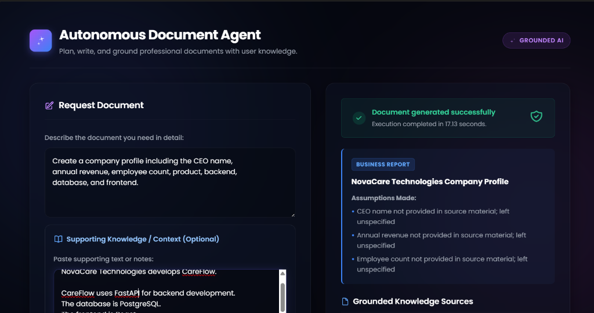
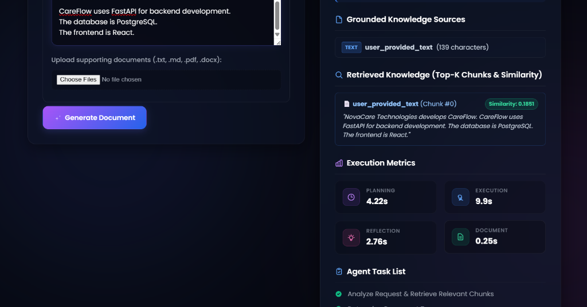

# RAG-Powered Autonomous Document Agent

An end-to-end RAG-powered document generation system that retrieves relevant information from user-provided documents and uses the retrieved context to generate grounded business documents.

Built with FastAPI, Groq (LLM), `pypdf`, `python-docx`, `sentence-transformers` (`all-MiniLM-L6-v2`), and `faiss-cpu`.

---

## 🌟 Key Capabilities
- **Multi-Format Ingestion**: Ingests PDF, DOCX, TXT, Markdown (.md), and direct user-entered text notes.
- **Text Chunking**: Word-based sliding window chunking (400 words, 50-word overlap) with source metadata tracking (`source_name`, `chunk_id`, `start_word`, `end_word`).
- **Dense Local Embeddings**: 384-dimensional dense semantic vector representations powered by `all-MiniLM-L6-v2` via `sentence-transformers` (runs completely locally).
- **FAISS Vector Search**: `IndexFlatIP` with L2-normalized vectors for exact cosine similarity nearest-neighbor retrieval.
- **Top-K Retrieval**: Configurable semantic retrieval returning the most relevant knowledge chunks with similarity scores.
- **Grounded Multi-Agent Generation**: Four-stage generation pipeline (**Planner $\to$ Executor $\to$ Reflector $\to$ DocGenerator**).
- **Missing-Information Handling**: Proactively detects absent information and explicitly states missing data rather than fabricating hallucinations.
- **Dual-Stage Quality & Grounding Review**: Built-in Reflector agent performs quality checks and fact-checking against retrieved sources.
- **DOCX Compilation**: Generates styled Microsoft Word (.docx) documents with cover pages, custom styling, headers, and footer page numbering.
- **Source & Retrieval Visibility**: Real-time frontend inspection panel displaying retrieved chunks, similarity scores, and source attribution.

---

## 🏗️ Grounded RAG Multi-Agent Architecture

The project integrates an end-to-end grounded document generation pipeline where user-provided knowledge directly guides planning, drafting, and quality review:

```
User Request + Source Documents / Direct Text
             │
             ▼
    ┌─────────────────┐
    │ Document Parser │ ──► Ingests & extracts TXT, MD, PDF, DOCX, Direct Text
    └────────┬────────┘
             │
             ▼
    ┌─────────────────┐
    │     Chunks      │ ──► Word-based sliding window chunks (400 words, 50 overlap)
    └────────┬────────┘
             │
             ▼
    ┌─────────────────┐
    │   Embeddings    │ ──► Local 384-dimensional dense vectors (all-MiniLM-L6-v2)
    └────────┬────────┘
             │
             ▼
    ┌─────────────────┐
    │   FAISS Index   │ ──► L2-normalized IndexFlatIP (Cosine Similarity)
    └────────┬────────┘
             │
             ▼
┌─────────────────────────┐
│  Similarity Retrieval   │ ──► Retrieves Top-K most relevant chunks with similarity scores
└────────────┬────────────┘
             │
             ▼
┌─────────────────────────┐
│    Retrieved Context    │ ──► Structured authoritative source context with metadata
└────────────┬────────────┘
             │
             ▼
    ┌─────────────────┐
    │  Planner Agent  │ ──► Outlines grounded sections & records missing information
    └────────┬────────┘
             │
             ▼
    ┌─────────────────┐
    │ Executor Agent  │ ──► Drafts section content strictly grounded in retrieved facts
    └────────┬────────┘
             │
             ▼
    ┌─────────────────┐
    │ Reflector Agent │ ──► Dual Review: Document Quality + Factual Integrity & Grounding
    └────────┬────────┘
             │
             ▼
    ┌─────────────────┐
    │  DocGenerator   │ ──► Compiles structured Microsoft Word document (.docx)
    └────────┬────────┘
             │
             ▼
       [Grounded .docx]
```

### 🧠 How RAG Grounds Generation
- **Authoritative Fact Source**: The retrieved chunks provide the primary factual grounding for the Planner, Executor, and Reflector agents.
- **Missing Information Handling**: If the user requests specific attributes (such as CEO name, annual revenue, or employee count) that are absent from the retrieved source context, the agents do not invent mock values—they explicitly state that the information was not provided in the source material.
- **RAG & Hallucination Mitigation**: Grounding the LLM generation in retrieved chunks drastically reduces unsupported generation. However, RAG alone does not guarantee mathematical zero hallucinations; our Reflector agent performs a secondary fact-checking review pass to flag and correct any stray ungrounded assertions.

---

## 📸 Application Interface & RAG Grounding Demo

### Grounded Planning & Missing Information Handling
The agent ingests source documents, outlines the document, and notes unspecified details (such as missing CEO, revenue, or employee counts) in assumptions rather than hallucinating:



### Retrieved Knowledge Inspection & Real-Time Metrics
Users can inspect the exact source chunks retrieved by FAISS with cosine similarity scores and monitor agent execution times:



---

## 🔍 Educational Guide: Understanding the RAG Retrieval Pipeline

### 1. Chunking
* **Why it's needed**: Large documents cannot be embedded as single monolithic units without losing granular semantic details and exceeding model token limits.
* **How it works**: Documents are split into word-based chunks (e.g., 400 words) with a sliding window overlap (e.g., 50 words). The overlap ensures that sentences or concepts located near chunk boundaries are preserved.
* **Metadata Tracking**: Every chunk retains its `source_name`, `source_type`, `chunk_id`, `start_word`, and `end_word`.

### 2. Embeddings
* **Why it's needed**: Computers cannot compare the conceptual meaning of raw text directly with keyword search alone.
* **How it works**: We use `all-MiniLM-L6-v2` from `sentence-transformers` (runs locally, no cloud API required) to project text into a 384-dimensional dense semantic vector space ($\mathbb{R}^{384}$). Semantically similar phrases end up geometrically close in this space.

### 3. Vector Store (FAISS)
* **Why FAISS**: Facebook AI Similarity Search (FAISS) is an optimized C++ library with Python bindings designed for high-throughput, low-latency nearest-neighbor search across dense vector collections.
* **Index & Metadata Separation**: The FAISS index stores the numerical float32 vectors, while a synchronized list maintains the corresponding chunk metadata at matching index positions.

### 4. Query Embedding
* **How it works**: When a user asks a question, the query string is converted into a 384-dimensional vector using the exact same embedding model as the document chunks. This ensures both queries and documents live in the same vector coordinate system.

### 5. Similarity Search & Cosine Similarity via Inner Product
* **Mathematical Property**:
  Cosine similarity between vector $A$ and vector $B$ is:
  $$\text{Cosine Similarity}(A, B) = \frac{A \cdot B}{\|A\|_2 \|B\|_2}$$
* **Why `IndexFlatIP` with `normalize_L2`**:
  When all document vectors and query vectors are pre-normalized so that $\|A\|_2 = 1$ and $\|B\|_2 = 1$, the cosine similarity simplifies exactly to the inner product:
  $$\text{Cosine Similarity}(A, B) = A_{\text{norm}} \cdot B_{\text{norm}}$$
  Using `faiss.normalize_L2(...)` and `faiss.IndexFlatIP(dimension)` calculates exact cosine similarity with maximum performance, where higher scores (closer to 1.0) indicate higher semantic similarity.

### 6. Top-K Retrieval
* **Why Top-K**: Instead of reading the entire knowledge base, the system retrieves only the top $K$ (e.g., $K=3$) most relevant chunks that have the highest cosine similarity to the user query.

### 7. Important Note on Absence Detection
> [!IMPORTANT]
> **FAISS similarity search does not inherently determine whether information exists in the knowledge base.**
> FAISS measures geometric closeness and will always return the mathematically closest vectors in the index, even for queries about facts that are completely absent from the source documents. True absence detection and context sufficiency are evaluated in subsequent pipeline stages.

---

## 🚀 Setup & Execution

### 1. Prerequisites
Ensure you have Python 3.10+ installed.

### 2. Install Dependencies
Create a virtual environment and install project packages:
```bash
# Create virtual environment
python -m venv venv

# Activate virtual environment
# Windows (cmd):
.\venv\Scripts\activate.bat
# Windows (PowerShell):
.\venv\Scripts\Activate.ps1
# macOS/Linux:
source venv/bin/activate

# Install requirements
pip install -r requirements.txt
```

### 3. Configure API Key
Create a `.env` file in the root folder (or copy from `.env.example`):
```bash
copy .env.example .env
```
Open `.env` and set your Groq API key:
```env
GROQ_API_KEY=your_actual_groq_api_key_here
GROQ_MODEL=openai/gpt-oss-120b
MAX_FILE_SIZE_MB=10.0
```

### 4. Run Retrieval Tests & Verification
Run the manual RAG inspection script:
```bash
python scripts/test_retrieval.py
```

Run all automated unit and integration tests:
```bash
python -m unittest discover tests
```

### 5. Start the Application
Run the development server using Uvicorn:
```bash
uvicorn main:app --reload
```

The application will be live at **[http://127.0.0.1:8000](http://127.0.0.1:8000)**.
